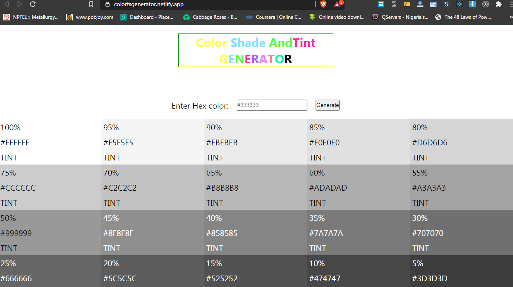

## [https://colortsgenerator.netlify.app](https://colortsgenerator.netlify.app)

 ### What am I?
 I am a simple app that quickly generates tints and shades for my users in an easy and convenient way. 
 
 ### Why was I made?
 My creator [bonarhyme](https://twitter.com/bonarhyme) was finding it irksome to easily swittch between a particular shade or tint of a color and so decided to make me to ease up his work.
 
 ### How can I be used?
 To use my services visit [https://colortsgenerator.netlify.app](colortsgenerator.netlify.app). Note that you need an understanding of how hexidecimal color (hex color) codes work.
 
 ### How are hex colors used?
 Hex color codes simplifies the naming convention of colors unlike other primary naming conventions such as the hsla (hue, saturation, lightness and alpha). 
 Hex color codes begins with a compulsory hash sign (#) that is followed by six (6) characters e.g **#333333**.  The six characters are divided in pairs, such that each pairs represents the three basic colors (red, green and blue). Each character must either be a number ranging from 0 to 9 or alphabets ranging from A to F.  A combination of numbers and alphabets are allowed.
 
 
 
 **Examples of hex color codes**
 
Hex color code | Color Name
------------ | -------------
#ffffff | White
#000000 | Black
#ff0000 | Red
#00ff00 | Green
#0000ff | Blue
#00ffff | Cyan
#ffff00 | Yellow
#ff00ff | Magenta

### What are color shades?
A shade is created by adding black to a base hue, darkening the color. This creates a deeper, richer color. Shades can be quite dramatic and can be overpowering.

### What are color tints?
A tint is created by adding white to a base hue, lightening the color. This can make a color less intense, and is useful when balancing more vivid color combinations.

Explore [https://colortsgenerator.netlify.app](colortsgenerator.netlify.app) to see 20 unique tints and also 20 unique shades of any particular color.

_Leave a star and follow [bonarhyme](https://twitter.com/bonarhyme)_
